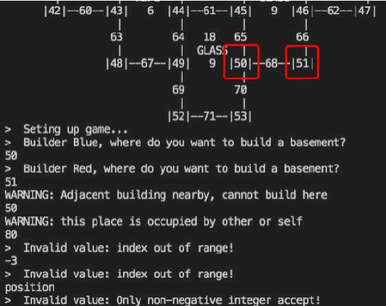

# Constructor — a Catan-style board game in C++14

Final project for CS 246 (Object-Oriented Software Development), University of Waterloo, Spring 2021. Team of three, July 26 to August 13, 2021. Terminal game with a hand-drawn ASCII board, four builders, dice, resource distribution, roads and residences, trading, geese, save/load, and a customizable mode.

Team (alphabetical): Shuchen Liu (`ShuchenLiu666`), Yuanhao Liu (`Haise-Turquoise`), Yutong Jiang (`IvyJiang7`).



*Bottom of the board and the input guards on the build-a-basement prompt, from `README/demo.pdf`.*

## Build and run

```
make            # g++ -std=c++14, builds ./ctor
./ctor          # default board from layout.txt
./ctor -seed 42 -random-board
./ctor -load backup.txt
./ctor -board mylayout.txt -customize
```

| Option | Effect |
|---|---|
| `-seed n` | Seed for the random generator, used throughout |
| `-load file` | Resume a saved game |
| `-board file` | Start from a board layout file |
| `-random-board` | Generate a random board |
| `-customize` | Choose victory points, geese on or off, and suggestions |

In-game commands include `roll`, `load` / `fair` (switch dice), `board`, `status`, `residences`, `build-road <n>`, `build-res <n>`, `improve <n>`, `trade`, `next`, `save <file>`, `quit`. The full command list, error messages and a complete play-through are in [`README/demo.pdf`](README/demo.pdf).

## Design

Eleven classes in four groups (full design in [`README/design.pdf`](README/design.pdf), class diagram in [`README/uml-final.pdf`](README/uml-final.pdf)):

- **Board components**: `Tile`, `Vertex`, `Edge`, plus the `Subject` / `Observer` pair. A tile is a subject; the vertices around it observe it. When the dice value matches a tile, the tile notifies its vertices and each vertex pays its owner one, two or three resources depending on the building level.
- **Dice**: `Dice` with a `Strategy` (`DiceRand`, `DiceLoad`) so a game can switch between fair and loaded dice at any turn.
- **Player**: the rule engine for building. Residences need a free vertex with no adjacent building and a connected road; roads cannot cross another player's building; upgrades follow a cost table.
- **Game controller**: `CtorGame` wraps `Board` and runs turns, trading, geese and save/load; `main` parses the options.

The class interfaces were written on the first day so the three of us could implement against fixed headers in parallel. The design document records what changed between the first and second design: redundant adjacency fields were removed after measuring that re-attaching cost less than the bounded loop they saved; a single bidirectional attach method replaced two; the dice moved from `Board` to `Player`; owner references became pointers; raw pointers became smart pointers.

Every public entry point validates its input in a fixed order — null, occupied, uninitialized, out of range, resources, adjacency — and prints a warning with the source line, which is what the screenshot above shows.

## Who did what

From `git log` and `git blame` on this repository (344 commits, about 2,250 lines of code at HEAD):

| Area | Owner | Notes |
|---|---|---|
| All class headers, day one | Yuanhao Liu | `board.h`, `player.h`, `tile.h`, `vertex.h`, `edge.h`, `subject.h`, `observer.h` on July 29 |
| `Tile` / `Vertex` / `Edge` / `Subject` / `Observer` | Yuanhao Liu | Untested versions accepted the next day with no changes beyond renaming |
| `Player` rule engine | Yuanhao Liu, with additions by Shuchen Liu | Building, roads, upgrades, blocking rules |
| `Board` rendering and construction adapters | Yuanhao Liu | ASCII renderer, index arithmetic, six adapter methods with guards |
| `Board` game logic, `CtorGame`, `main`, save/load, trading, geese, smart-pointer refactor | Yutong Jiang | Most of `board.cc` and all of `ctorgame.cc` |
| `Dice` and `Strategy` | Shuchen Liu | Loaded and fair dice |
| Test tooling and build files | Yuanhao Liu | `auto-valgrind-tool/runSuiteVal`, `a6test.cc`, `board-test.cc`, `Makefile-a6-test` |
| Allocation docs, test-case lists, coding rules | Yuanhao Liu (docs), everyone (t-lists) | `0mission_allocation/`, `0t-list/`, `code_tip.txt` |

Line share of the final code by `git blame`: roughly 36% Yuanhao, 43% Yutong, 20% Shuchen. Design document sections: Overview and Resilience to Change by Yuanhao, Design by Shuchen, Introduction and Extras by Yutong; UML by Yuanhao; demo by Yutong.

## Timeline

| Date | What happened |
|---|---|
| Jul 29 | Initial commit, coding rules, all headers, untested implementations of the five base classes, Makefile template, valgrind runner, first allocation document |
| Jul 30 | Base-class implementations accepted unchanged; `Board` logic, `CtorGame`, `Dice` and `Strategy` started |
| Jul 31 | `Board` renderer and adapters, `Player` rule engine, test harnesses |
| Aug 1 to 5 | Geese and park tiles, save/load, trading, cross-review test matrix, second allocation document |
| Aug 3 | Smart-pointer refactor (extra credit) |
| Aug 8 | Design document and class diagram |
| Aug 11 to 12 | Final fixes, demo write-up, last code commit |

## How we worked

- A rough plan first; the second allocation document reallocated work by results when someone was busy.
- Compile every 20 lines to avoid nested bugs.
- Strong types and range checks in the base objects, so failures are reported instead of silently producing wrong state.
- Never `using namespace std` in a header; check for null before `->`; print `__LINE__` in warnings so a failure can be found in seconds.
- Each of us tested another's part: Yutong tested Yuanhao's code, Yuanhao tested Shuchen's, Shuchen tested Yutong's. Test cases were listed per person in `0t-list/` before testing.
- One person made each change and pushed directly, so there was always a single current version.

## Repository layout

```
*.h, *.cc              game source
Makefile               builds ./ctor
Makefile-a6-test       builds the ADT test harness (a6test.cc, board-test.cc)
auto-valgrind-tool/    runSuiteVal: runs the test suite under valgrind
layout.txt             default board layout
blueWon.txt            sample saved game
README/                design.pdf, uml-final.pdf, demo.pdf, screenshot
0mission_allocation/   work allocation documents (Jul 29, Aug 2) and the sample code we were given
0t-list/               per-person test-case lists
code_tip.txt           team coding rules
back-up/               day-3 snapshots of board and player
```

## What I would change now

Written in 2026, looking back at 2021 code.

- Throw typed exceptions instead of `const char*`, and report warnings on `cerr` rather than `cout`.
- Replace the harness executables with a unit-test framework, and run it in CI rather than by hand.
- The six construction adapters in `Board` repeat the same guard block; one guard function would remove the duplication.
- Separate rendering from `Board`: the ASCII printer knows the board shape, and changing the shape means editing three places, as the design document admits.
- The design document describes vertices and edges observing each other; that mechanism was never built. The document should have been corrected when the design changed.
- Write this README at the start, not five years later.
